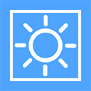
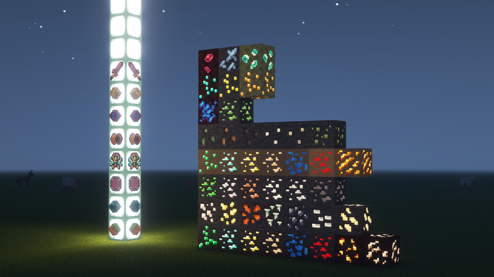

  
  <h3>Emissive Project</h3>
  
自发光计划

  
  
  
  
  

  
简体中文 | <a href="./README-en.md">English</a>

### # 材质简介

此材质包主要用于拓展模组物品的发光方块，使用 Optifine Emissive 自发光实现，所以要使用此包，必须安装Optifine。

### # 模块化

为了防止资源过多导致加载时间过长，以及仅需要部分类型发光而特别以分包(模块化)制作。

#### 目前已有模块化包:

- Ore - 自发光矿石

### 目前已支持模组的自发光方块类型

| 模组名称              | 矿物 |
| --------------------- | ---- |
| Thermal               | √    |
| Atum                  | √    |
| Mekanism              | √    |
| Immersive Engineering | √    |
| Tinkers Construct     | √    |
| Extreme Reactors      | √    |
| Gobber2               | √    |

### 待支持模组列表

暂无，可前往 [issues](https://github.com/FastChen/Emissive-Project/issues) 发布模组支持请求。

### 图片

